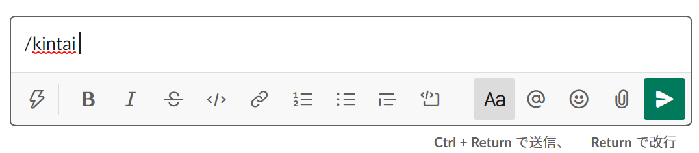
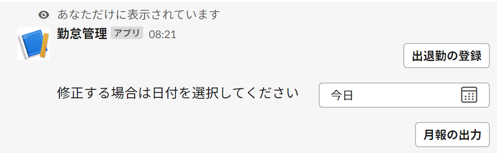
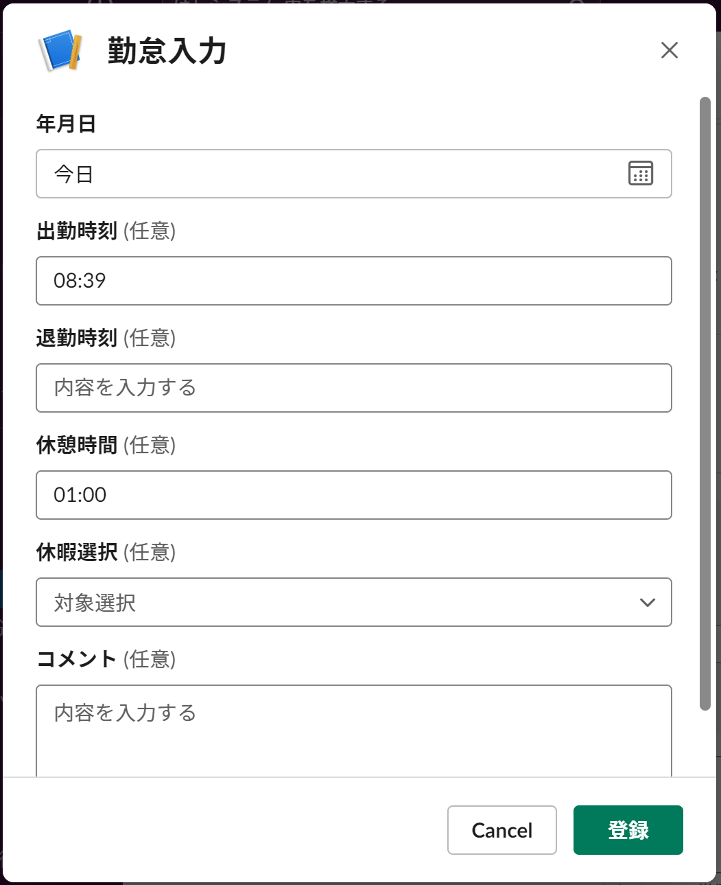
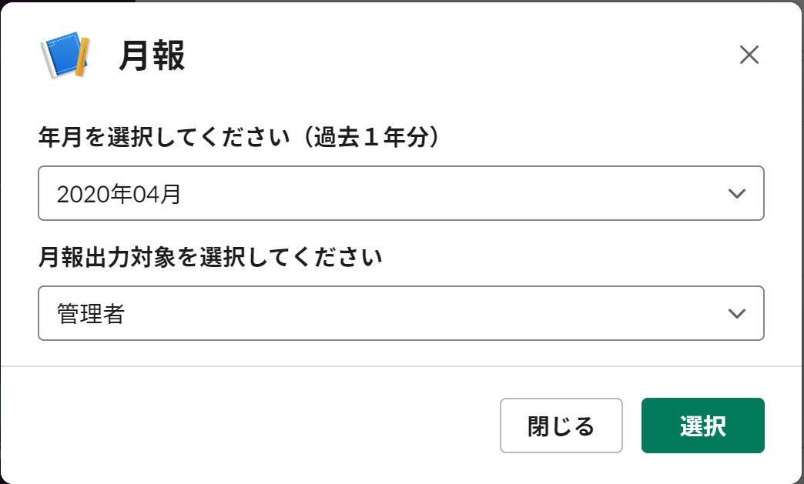
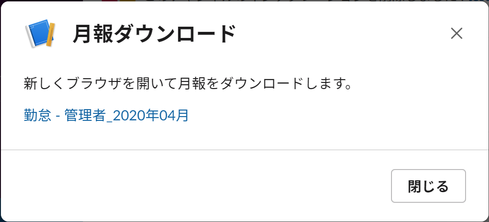
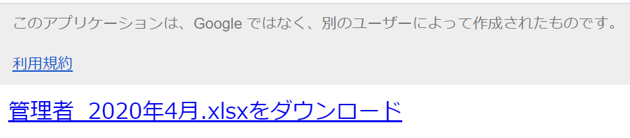

# 勤怠管理 SlackApp

slackを利用して勤怠管理を行います。  
スマホからいつでもどこでも勤怠登録♪

勤怠記録は、管理者のGoogleドライブに保存されます。

# 使い方

1. Slashコマンドの入力
	
	任意のチャンネルで「/kintai」とSlashコマンドを入力します  

2. 勤怠の登録
	
	botから応答が返ってきます

	2-1. 出退勤の登録
	
	各項目を入力して、登録ボタンを押下してください  
	※入力値のチェックとかしていないので、時刻とか半角で入力してください...  
	※最初に登録するとき、タイムアウト(3秒!)でエラーになってしまうことがありますが、たぶん登録されているので気にしないでください

	2-2. 出退勤の修正  
	日時を選択してください。  
	出退勤の登録と同じ画面が表示されて、指定日時の勤怠記録を修正できます

	2-3. 月報の出力
	
	出力したい年月と対象のユーザーを選択してください

	
	リンクが表示されて、月報の出力処理を行います  
	※処理に時間がかかるため、ブラウザへの外部リンクになります

	
	リンクをクリックすると、エクセル(xlsx)形式で月報をダウンロードします

# Installation
1. Googleアカウント作成  
管理者のアカウントを作成します。

1. slackワークスペース作成  
https://slack.com/intl/ja-jp/  
新しく作成  

1. GAS(Google Apps Script)準備  
	1. Googleドライブに移動  
	マイドライブ -> ＋新規 -> その他 -> アプリを追加  

	1. G Suite Marketplace  
		Google Apps Script -> インストール  
		権限 -> Googleアカウントでログイン -> インストール完了  
		マイドライブ -> ＋新規 -> その他 -> Google Apps Script  
	※マイドライブをリロードする必要あるかも？  

	1. プロジェクトを作成  
	「無題のプロジェクト」を選択して名称変更→「slack_app」に変更(ちょっと待つ)  
	コード.gs -> rename →「app.gs」に変更  

	1. GASライブラリ追加  
	リソース -> ライブラリ -> Add Library  

		- **Underscore**  
	M3i7wmUA_5n0NSEaa6NnNqOBao7QLBR4j  
	(バージョン：2)  

	1. 公開  
		公開 -> ウェブアプリケーションとして導入  
		**Project Version**:    New (毎回Newを選びましょう)  
		**Execute the app as**: Me  (そのまま)  
		**Who has access to the app**: Anyone, even Anonymouse  

		Deployボタン -> 許可を確認 -> アカウント選択 -> 詳細リンク -> slack_app（安全ではないページ）に移動 -> 許可

	1. 「slack_view」も「slack_app」と同様に作成＆公開  

	1. 「slack_get」も「slack_app」と同様に作成  
		1. index.html作成  
		ファイル -> New -> HTMLファイル

		1. 同様に公開

1. slack app作成  
https://api.slack.com/apps  
「Create an App」ボタン  
	**App Name**	勤怠管理  
	**Development Slack Workspace** 作成したslackのワークスペース

	1. Slash Commandsの作成  
	Features(左メニュー) -> Slash Commands  
		Create New Command  
		**Command**            /kintai            
		**Request URL**        slack_appの公開URL  
		**Short Description**  勤怠管理           

	1. Bot作成  
	Features(左メニュー) -> App Home  
		App Display NameのEditボタン押下  
		**Display Name**       kintai  
		**Default username**   kintai

	1. OAuth & Permissions  
	Features(左メニュー) -> OAuth & Permissions  
		Install App  
		**Bot User OAuth Access Token**:	(GASからslackに投稿する際に必要)

	1. Incoming Webhooks  
	Features(左メニュー) -> Incoming Webhooks  
		Activate Incoming Webhooks	Off -> On  
		**Add New Webhooks To Workspace**	投稿先チャンネルを選択  

	1. Interactive Components  
	Features(左メニュー) -> Interactive Components  
		Interactivity	Off -> On  
		**Request URL**		slack_viewの公開URL  

	※Botの許可方法とか順番かわったかも

1. Googleスプレッドシート
	1. 作成  
	googleのマイドライブ  
	新規 -> Googleスプレッドシート  
	ファイル -> 名前を変更:	勤怠  
	シートを作成  
		1. **user** シート  
		ユーザー情報の管理を行います。

		1. **template** シート  
		勤怠情報シートのtemplateになります。

		1. **Log** シート（デバッグ情報必要なければ不要）  
		空シートでOK

1. GASのプロパティ設定  
ファイル -> プロジェクトのプロパティ -> スクリプトのプロパティに追加  

	1. スプレッドシートID  
	スプレッドシートのURLからIDを抽出  

	https://docs.google.com/spreadsheets/d/[スプレッドシートID]/

	|プロパティ      |値                  |
	|----------------|--------------------|
	|SPREAD_SHEET_ID |[スプレッドシートID]|

	各GASに設定する  

	1. OAuth & Permissions  
	slackのBot User OAuth Access Tokenをプロパティに設定

	|プロパティ         |値                           |
	|-------------------|-----------------------------|
	|OAUTH_ACCESS_TOKEN |[Bot User OAuth Access Token]|

	GASのslack_viewに設定する

	1. 月報出力GASのURL  
	GASのURLからIDを抽出  
	https://script.google.com/macros/s/[gas_id]/exec

	|プロパティ|値      |
	|----------|--------|
	|SLACK_GET |[gas_id]|

以上でInstallおわり(長くてすみません)

# Usage

- ユーザーの管理
	- 勤怠スプレッドシートの「user」シートに登録
		- No				ユーザー連番です。PGで使用してません。
		- 名前				ユーザーの名前です。勤怠シートがこの名前で作成されます。
		- slackユーザー名	slackに登録したユーザー名です。
		- 休憩時間			勤務時間（勤務終了時刻 - 勤務開始時刻）から引かれます。
		- グループ			ユーザーの所属するグループです。空でもOK
		- 参照権限			月報の参照権限です。ALL, グループ名, selfを設定。

| No| 名前   | slackユーザー名 | 休憩時間 | グループ | 参照権限 |
|---|--------|-----------------|----------|----------|----------|
| 1 | 管理者 | slack.kanri     | 1:00     | GroupA   | all      |

- 勤怠情報シートのテンプレート
	- 勤怠スプレッドシートの「template」シートを追加  

|西暦 | 年 | 月 | 日 | 出勤時刻 | 退勤時刻 | 休憩時間 | 勤務時間 | 休暇 | コメント |
|-----|----|----|----|----------|----------|----------|----------|------|----------|
|     |    |    |    |          |          |          |          |      |          |

- Slashコマンドの入力
	- 「/kintai」コマンドを入力すると、登録してあるユーザーに「出退勤の登録」「月報の出力」ボタンが表示されます。

# Note

	・単純な勤務時間計算しかしてません（勤務終了時刻 - 勤務開始時刻 - 休憩時間）  
	・入力値のvalidationだったり整合性チェックだったりは未実装  
	・slackのタイムアウト  
		最初に勤怠登録すると出がち。処理自体はうまくいってるはず...  
		勤務データが増えると心配。
	・modalのviews.updateがうまくいかない・・。  
		iphone, androidだと上手く更新されません。

# Author

* はしシステム
* slack.hashiken@gmail.com

# License

under [MIT license](https://en.wikipedia.org/wiki/MIT_License).
